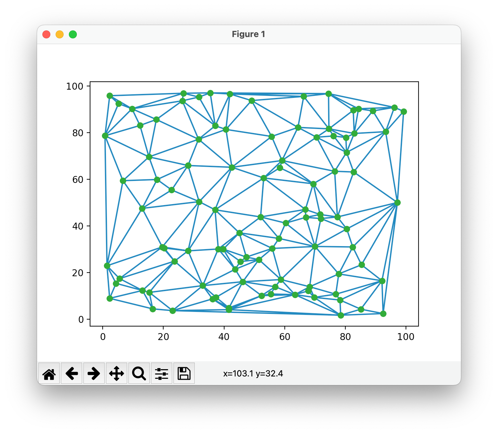

Examples
============

Reading a LAZ file
------------------

.. code-block:: python

   import startinpy

   dt = startinpy.DT()
   dt.read_las("/home/elvis/myfile.laz", classification=[2,6])
   print("# vertices:", dt.number_of_vertices())
   

Exporting the DT to GeoJSON
---------------------------

.. code-block:: python

   import startinpy
   import numpy as np
   
   #-- generate 100 points randomly in the plane
   rng = np.random.default_rng(seed=42)
   pts = rng.random((100, 3))
   dt = startinpy.DT()
   dt.insert(pts, insertionstrategy="AsIs")
   dt.write_geojson("/home/elvis/myfile.geojson")

Reading a GeoTIFF file with rasterio
------------------------------------

We can use `rasterio <https://rasterio.readthedocs.io>`_ to read a GeoTIFF and triangulate the centre of the pixels/cells directly.
Notice that retrieving the (*x,y*)-coordinates of the centres with the `xy() function <https://rasterio.readthedocs.io/en/latest/api/rasterio.io.html?highlight=xy#rasterio.io.DatasetReader.xy>`_ is **super slow** and it's better to just use the code below.

Notice that we use the insertion strategy "BBox" because it is several orders of magnitude faster for gridded datasets.

The no_data values are not inserted in the triangulation.

This code saves the resulting triangulation to a `PLY file <https://en.wikipedia.org/wiki/PLY_(file_format)>`_ that can be opened directly in QGIS (with the newish `MDAL mesh <https://docs.qgis.org/3.22/en/docs/user_manual/working_with_mesh/mesh_properties.html>`_).

.. code-block:: python

   import startinpy
   import rasterio

   d = rasterio.open('mydem.tif')
   band1 = d.read(1)
   t = d.transform 
   pts = []
   for i in range(band1.shape[0]):
       for j in range(band1.shape[1]):
            x = t[2] + (j * t[0]) + (t[0] / 2)
            y = t[5] + (i * t[4]) + (t[4] / 2)
            z = band1[i][j]
            if z != d.nodatavals:
                pts.append([x, y, z])
   dt = startinpy.DT()
   dt.insert(pts, insertionstrategy="BBox")
   #-- exaggerate the elevation by a factor 2.0
   dt.vertical_exaggeration(2.0)
   dt.write_ply("mydt.ply")

.. image:: figs/mdal.png

Plotting the DT with matplotlib
-------------------------------

.. code-block:: python

   import startinpy
   import numpy as np
   
   #-- generate 100 points randomly in the plane
   rng = np.random.default_rng(seed=42)
   pts = rng.random((100, 3))
   #-- scale to [0, 100]
   pts = pts * 100 
   t = startinpy.DT()
   t.insert(pts)
   pts = t.points
   trs = t.triangles
   #-- plot
   import matplotlib.pyplot as plt
   plt.triplot(pts[:,0], pts[:,1], trs)
   #-- the vertex "0" shouldn't be plotted, so start at 1
   plt.plot(pts[1:,0], pts[1:,1], 'o')
   plt.show()

