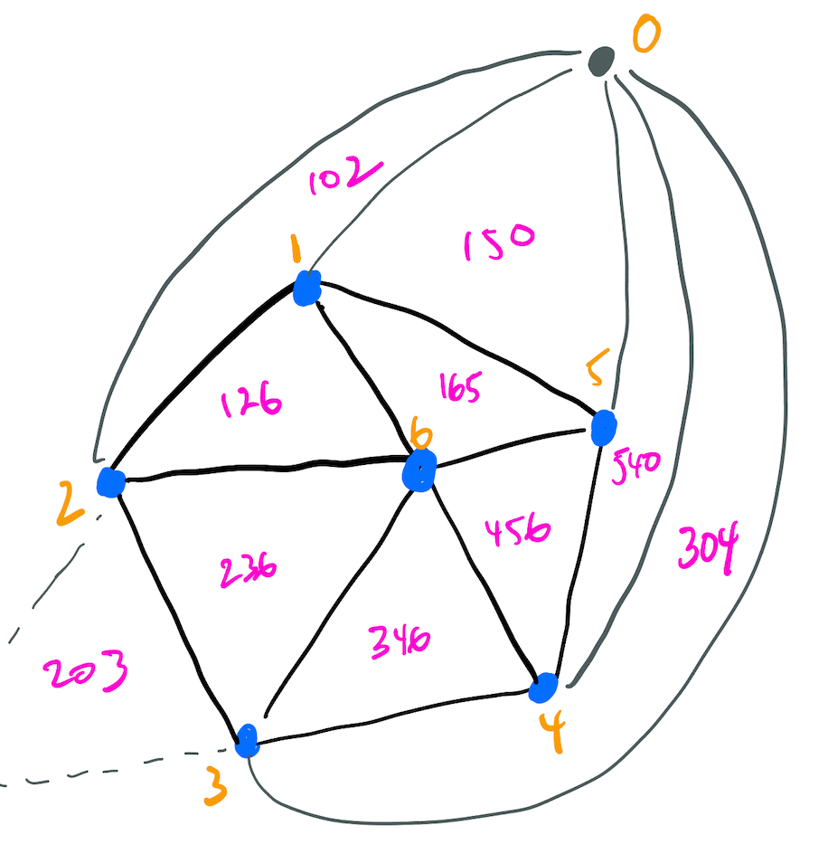
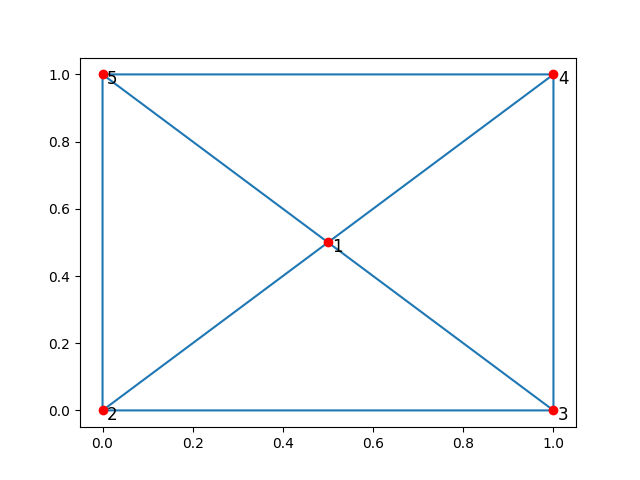

How startinpy works
===================

Original code written in rust
-----------------------------
startinpy source code in written in `Rust <https://www.rust-lang.org/>`_ (called just 'startin', `original source code <https://github.com/hugoledoux/startin>`_).

Robust arithmetic for the geometric predicates are used (`Shewchuk's predicates <https://www.cs.cmu.edu/~quake/robust.html>`_, well the `Rust port of the code <https://crates.io/crates/robust>`_), so startin/py is robust and shouldn't crash (touch wood). 

Insertion + deletion are possible
---------------------------------
It uses an incremental algorithm for the construction of a Delaunay triangulation (constraints are *not* supported), that is each point are inserted one after another and triangulation is updated between each insertion.
The algorithm is based on flips.

The deletion of a vertex is also possible. 
The algorithm implemented is a modification of the one of `Mostafavi, Gold, and Dakowicz (2003) <https://doi.org/10.1016/S0098-3004(03)00017-7>`_. 
The ears are filled by flipping, so it's in theory more robust. 
I have also extended the algorithm to allow the deletion of vertices on the boundary of the convex hull. 
The algorithm is sub-optimal, but in practice the number of neighbours of a given vertex in a DT is only 6, so it doesn't really matter.

.. _infinite:

Infinite vertex and triangles?
------------------------------

The implementation of startinpy uses the idea of *infinite triangles* and of *infinite vertex*, this simplifies a lot the algorithm and ensures that one can insert new points outside the convex hull of a dataset (or even delete some vertices on the boundary of the convex hull).
The CGAL library also does this, and `it is well explained here <https://doc.cgal.org/latest/Triangulation_2/classCGAL_1_1Triangulation__2.html>`_.
This is why the set of points (:func:`startinpy.DT.points`) has its first vertex as the *infinity vertex*, and it has dummy coordinates ``[-99999.99999 -99999.99999 -99999.99999]``

The data structure
------------------
The data structure of the Rust code is a cheap implementation of the star-based structure defined in `Blandford et al. (2003) <https://citeseerx.ist.psu.edu/viewdoc/summary?doi=10.1.1.9.6823>`_, cheap because the link of each vertex is stored a simple array and not in an optimised blob like they did.
It results in a pretty fast library (comparison will come at some point), but it uses more space than the optimised one.

However, the stars are *not* exposed in startinpy to keep it a simple and higher-level library.

startinpy stores 2 arrays:

1. an array of **Points**, where each entry is an array of 3 floats (x-coordinate, y-coordinate, z-coordinate)
2. an array of **Triangles**, where each **Triangle** is an array of 3 integers, the values of the indices of the 3 vertices (ordered counter-clockwise) in the array of **Points** (:func:`startinpy.DT.points`, which is 0-based, 0 being the infinite vertex).

A **Vertex** is an integer, it is the index in the array of points (:func:`startinpy.DT.points`, which is 0-based).

If you delete a vertex (with :func:`startinpy.DT.remove`) then the entry in the array of **Points** is not deleted (this would be slow because arrays are contiguous and a lot of copying would be necessary), instead the vertex/point is flagged as being removed and none of the **Triangles** will refer to it.

Some concrete examples
----------------------

For instance, consider this 5-vertex Delaunay triangulation:

.. code-block:: python

    import startinpy

    np.set_printoptions(precision=10)

    t = startinpy.DT()
    t.insert_one_pt(0.5, 0.5, 1.0)
    t.insert_one_pt(0.0, 0.0, 2.0)
    t.insert_one_pt(1.0, 0.0, 3.0)
    t.insert_one_pt(1.0, 1.0, 4.0)
    t.insert_one_pt(0.0, 1.0, 5.0)

    print(t.points)
    print(t.triangles)

Which outputs this below. 
Notice first that there are 6 vertices: the 5 we inserted plus the infinite vertex (with dummy coordinates -99999.99999...).
Notice also no finite triangles refers to the vertex 0.

.. code-block:: 

    [[-9.999999999e+04 -9.999999999e+04 -9.999999999e+04]
     [ 5.000000000e-01  5.000000000e-01  1.000000000e+00]
     [ 0.000000000e+00  0.000000000e+00  2.000000000e+00]
     [ 1.000000000e+00  0.000000000e+00  3.000000000e+00]
     [ 1.000000000e+00  1.000000000e+00  4.000000000e+00]
     [ 0.000000000e+00  1.000000000e+00  5.000000000e+00]]
    [[1 2 3]
     [1 3 4]
     [1 4 5]
     [1 5 2]]

However, there are in the data structure infinite triangles (having the vertex 0 as one of their vertices).
If you retrieve the incident triangles to a vertex on the convex hull you get one infinite triangle:

.. code-block:: python

    re = t.incident_triangles_to_vertex(2)
    for each in re:
        print(each)

.. code-block:: 

    [2 0 3]
    [2 3 1]
    [2 1 5]
    [2 5 0]

And if you remove one vertex (the one in the middle of the square, vertex 1), observe that now its coordinates are also having dummy coordinates, and that no triangles refer to it anymore:

.. code-block:: python

    t.remove(1)
    print(t.points)
    print(t.triangles)

.. code-block:: 

    [[-9.999999999e+04 -9.999999999e+04 -9.999999999e+04]
     [-9.999000000e+02 -9.999000000e+02 -9.999000000e+02]
     [ 0.000000000e+00  0.000000000e+00  2.000000000e+00]
     [ 1.000000000e+00  0.000000000e+00  3.000000000e+00]
     [ 1.000000000e+00  1.000000000e+00  4.000000000e+00]
     [ 0.000000000e+00  1.000000000e+00  5.000000000e+00]]
    [[2 3 4]
     [2 4 5]]

Finally, you can remove those unused vertices from the :func:`startinpy.DT.points` array by using :func:`startinpy.DT.collect_garbage`, which will assign a new ID to most vertices and triangles will be updated too.
Notice that now 5 vertices are in the array, and only 2 finite triangles are in the DT.

.. code-block:: python

    t.collect_garbage()
    print(t.points)
    print(t.triangles)

.. code-block:: 

    [[-9.999999999e+04 -9.999999999e+04 -9.999999999e+04]
     [ 0.000000000e+00  0.000000000e+00  2.000000000e+00]
     [ 1.000000000e+00  0.000000000e+00  3.000000000e+00]
     [ 1.000000000e+00  1.000000000e+00  4.000000000e+00]
     [ 0.000000000e+00  1.000000000e+00  5.000000000e+00]]
    [[1 2 3]
     [1 3 4]]