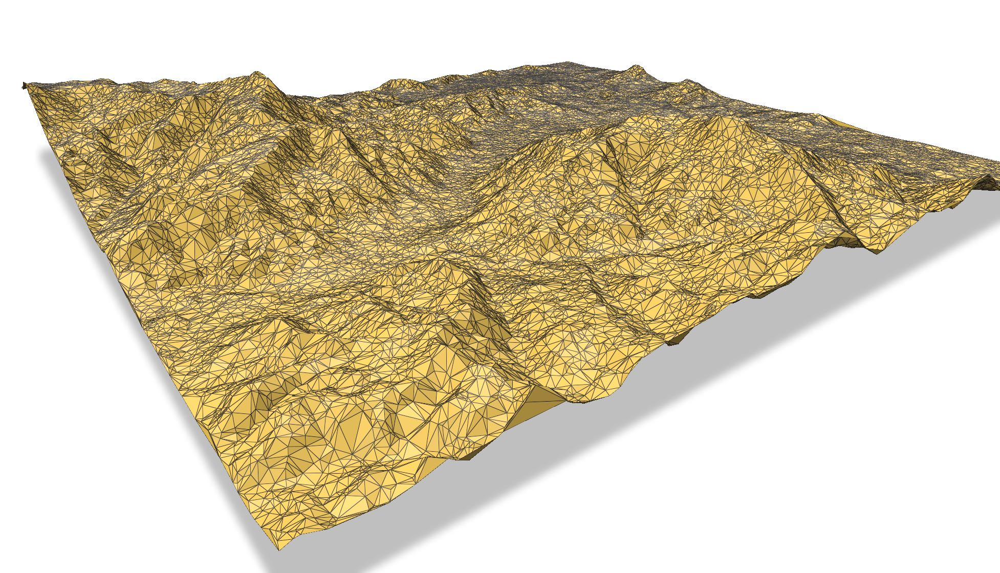

startinpy 
=========

A Delaunay triangulator where the input are 2.5D points (they have an elevation), the Delaunay triangulation (DT) is computed in 2D but the elevation of the vertices are kept.
This is used mostly for the modelling of terrains, but other attributes could be used.

Originally written in `Rust <https://www.rust-lang.org/>`_ (so it's rather fast; `see Rust code <https://github.com/hugoledoux/startin>`_), and `robust arithmetic <https://crates.io/crates/robust>`_ is used (so it shouldn't crash).
The Python bindings just wrap the Rust code.

startinpy allows you to:

   1. insert incrementally points
   2. delete vertices (useful for simplification, interpolation, and other operations)
   3. interpolate with a few methods: TIN, natural neighbours, Laplace, IDW, etc.
   4. read directly LAS/LAZ files
   5. outputs the TIN in several formats: GeoJSON, OBJ, and PLY

.. code-block:: python

   import startinpy
   import numpy as np

   #-- generate 100 points randomly in the plane
   rng = np.random.default_rng()
   pts = rng.random((100, 3))
   pts = pts * 100

   dt = startinpy.DT()
   dt.insert(pts)

   #-- remove vertex #4
   try:
       dt.remove(4)
   except Exception as e:
       print(e)

   print("# vertices:", dt.number_of_vertices())
   print("# triangles:", dt.number_of_triangles())

   print("CH: ", dt.convex_hull())

   print(dt.is_triangle([4, 12, 6]) )
   print(dt.is_triangle([5, 12, 6]) )

   print("--- /Points ---")
   for each in dt.points:
       print(each)
   print("--- Points/ ---")

   alltr = dt.triangles
   print(alltr[3])

   zhat = dt.interpolate({"method": "TIN"}, [[55.2, 33.1]])
   print("result: ", zhat[0])

Table of content
================

.. toctree::
   :maxdepth: 0

   installation
   howitworks
   examples
   api
   issues

Indices and tables
==================

* :ref:`genindex`