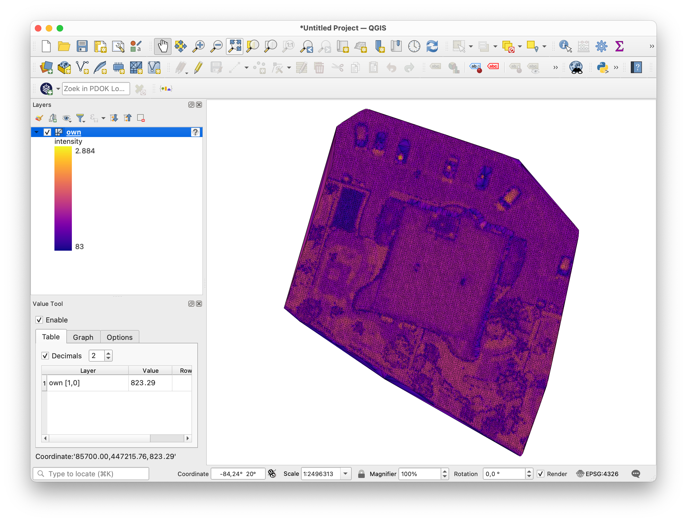

# Summary

The Python library *startinpy* can construct, modify, and manipulate triangulated terrains, commonly called TINs (triangulated irregular networks).
Given a dataset formed of elevation samples (eg collected with lidar or photogrammetry), it is possible to construct a TIN, remove points (eg outliers), convert to a gridded terrain (with spatial interpolation) or other known formats, attach attributes to the vertex, etc.
Observe that while startinpy is built primarily for points having a *z*-elevation, a Delaunay triangulation (DT) in 2D is computed (a TIN is a so-called 2.5D object); this means that startinpy can be used for applications where a standard 2D DT is necessary.
Moreover, unlike several triangulation libraries, startinpy exposes its data structure, allowing users to obtain incident and adjacent triangles to vertices/triangles.
This can be useful for quality control, to derive properties like slope, to convert to different formats, etc.
The underlying code of startinpy is written in the language Rust (so it is relatively fast), robust arithmetic is used (so it should not crash), and it uses NumPy for input/output of data, which allows it to integrate with other Python libraries.


# Statement of need

There exist several Python libraries for computing the DT in 2D.
A search for "Delaunay triangulation" in the *Python Package Index* (PyPI) returns 227 packages, the most notable ones being SciPy (specifically `scipy.spatial.Delaunay`, which is a wrapper around Qhull [@Barber96], written in C) and Triangle (which is a wrapper around the fast and robust C library that performs constrained DT and meshing [@Shewchuk96a]).

When it comes to modelling 2.5D triangulated terrains, the existing Python libraries have, in general, four main issues:

  1. Libraries written in pure Python are too slow for modern datasets. Indeed, with a recent lidar scanner, we can easily collect 50 samples/$m^2$ (compared to 1 or 2 samples/$m^2$ a mere 15 years ago), which means that a 1$km^2$ area can contain around 50 million samples. Since constructing a DT requires several steps, if those steps are implemented in Python then the library becomes very slow.
  2. The data structure of the DT is not exposed; only a list of vertices and triangles (triplets of vertex identifiers) are returned. This means that the user has to build a graph to be able to find the adjacent triangles of a given one, or to find all the triangles that are incident to a given vertex (eg to calculate the normal).
  3. Both SciPy and Triangle construct a 2D DT in a *batch* operation: the DT for a set of points is constructed and cannot be modified after construction. Constructing *incrementally* a DT has several benefits: one can for instance construct a simplified TIN that best approximates the original terrain with only 10% of the points, see @Garland95 for different strategies. Also, the existing libraries do not allow the removal/deletion of points, which is useful when outliers are identified (by analysing the neighbouring triangles).
  4. While a 2D DT should be calculated, the *z*-values of the points should also be preserved. Some libraries allow us to attach extra information to a vertex, but most often one has to build auxiliary data structure in Python to manage those, which is error-prone, tedious, and makes operations in 3D complex operations (eg calculating the slope of an area, calculating the normal of a vertex, estimating the elevation with spatial interpolation, calculating volumes).


# Design and details of startinpy

startinpy was developed specifically for modelling 2.5D terrain with TINs, and addresses the four issues described above.


## #1: startinpy is written in Rust

The core of startinpy (construction of the DT, deletion, interpolation, etc) is written in Rust (and called "startin", the source code is available at https://github.com/hugoledoux/startin) and can be used in Rust programs.
A C-interface to the library is also available, it allows us to use, for instance, the library in Julia (https://github.com/evetion/startin.jl); it has been used recently to build a global coastal terrain using laser altimetric measurements from the space station [@Pronk24].
Observe that the robust predicates, as described in @Shewchuk96, are used (the code has been converted to pure Rust, see https://docs.rs/robust/latest/robust/), which means that startinpy should not crash because of floating-point arithmetic.
Also, since the library is not written in pure Python, a GitHub Action compiles the wheels for the lastest four versions of Python, and also for  Windows/macOS/Linux.

## #2: The data structure is partly exposed

The library's name comes from the fact that the data structure implemented is based on the concept of *stars* in a graph [@Blandford05], which allows us to store adjacency and incidence, and have a very compact data structure.
startinpy exposes methods to obtain the adjacent triangles of a triangle, and the incident triangles to a vertex.


## #3: Incremental insertion + deletion are possible

The construction algorithm used is an incremental insertion based on flips, and the deletion of a vertex is also possible.
The algorithm implemented is a modification of @Mostafavi03; I have extended it to allow the deletion of vertices on the boundary of the convex hull.

## #4: Extra attributes can be stored

It is possible to store extra attributes with each vertex, each attribute is stored as a JSON object/dictionary, a key-value pair where the key is a string and the value is either a float, an integer, a boolean, or a string.
This can be used to preserve the lidar properties of the input points (eg intensity, RGB, number of returns, etc.).
The Python libraries mentioned above cannot directly attach such information, an auxiliary data structure needs to be built and maintained by the user.

## Other implementation details

A few spatial interpolation methods that are based on the DT and/or its dual structure, the Voronoi diagram, have been implemented: linear interpolation in TINs, natural neighbours [@Sibson81], Laplace interpolation [@Belikov97], etc.

To facilitate the processing and analysis of large datasets and to integrate with other libraries (such as [laspy](https://github.com/laspy/laspy)), NumPy arrays are used; a few examples in the documentation are available.

Finally, it is possible to output the TIN into several formats: OBJ, PLY, GeoJSON, and CityJSON.
More formats are possible through the use of other Python libraries, there are a few examples in the documentation.


# Comparison with the main alternatives

The two tables below compare startinpy to its main alternatives.

The [Delaunator package](https://github.com/HakanSeven12/Delaunator-Python) is a pure Python port of a proven fast triangulator [originally written in JavaScript](https://github.com/mapbox/delaunator).
[SciPy](https://docs.scipy.org/doc/scipy/reference/generated/scipy.spatial.Delaunay.html) is `scipy.spatial.Delaunay`, and SciPy-inc is the variation where an incremental algorithm is used (instead of a batch process).
[Triangle](https://pypi.org/project/triangle/) is the Python bindings of the C code.

|                        | Delaunator | SciPy | SciPy-inc | Triangle | startinpy |
|------------------------|:----------:|:-----:|:---------:|:--------:|:---------:|
| constrained DT         |    --      | --    |     --    |   +      |   --      |
| data structure exposed |    +       | --    |     --    |   --     |   +       |
| efficient searches     |    +       | +     |     +     |   --     |   +       |
| elevation/2.5D         |    --      | --    |     --    |   --     |   +       |
| extra attributes       |    --      | --    |     --    |   --     |   +       |
| fast                   |    --      | --    |     --    |   ++     |   +       |
| incremental insertion  |    --      | --    |     +     |   --     |   +       |
| remove vertices        |    --      | --    |     --    |   --     |   +       |
| xy-duplicate handling  |    --      | --    |     --    |   --     |   +       |

Notice that startinpy is the only one capable of storing z-values and extra attributes, the others are pure 2D Delaunay triangulators.
The parameter 'efficient searches' refers to the availability of a point location function to find the closest triangles to a given point.
The parameter 'xy-duplicate handling' refers to the fact that startinpy allows us to merge vertices that are close to each other (in the xy-plane; the tolerance can be defined by the user) and that if there are xy-duplicates, then a user-defined z-value can be kept (eg lowest or highest, depending on the application).

The table below shows the time it takes to construct the 2D DT--in a batch operation--for different datasets.
The details of the (openly available) datasets are available on the [GitHub repository of startinpy](https://github.com/hugoledoux/startinpy/tree/master/dt_comparisons), and the Python code to replicate the experiments is available.
The datasets `random_X` are randomly generated points in a unit square, the first one has 10,000 points and the other 50,000 points.
The datasets `LAZ_X` are real-world aerial lidar datasets publicly available in the Netherlands, the `2M` contains exactly 2,144,049 points, and the `33M` contains exactly 33,107,889 points.
The dataset `dem.tiff` is the GeoTIFF file in `/data/`, the centre of each grid cell is inserted by reading sequentially the rows and columns, the total is 277,750 points.

|            |random_10k|random_50k|LAZ_2M|LAZ_33M|dem.tiff|
|:-----------|---------:|---------:|-----:|------:|-------:|
| Delaunator |   0.219  |    0.84  | 49.2 | 898.1 |   3.55 |
| SciPy      |   0.017  |    0.09  | 10.1 | 650.3 |   1.79 |
| SciPy-inc  |   0.015  |    0.08  |    X |     X |      X |
| Triangle   |   0.004  |    0.02  |  0.9 |  16.8 |   0.19 |
| startinpy  |   0.018  |    0.18  |  4.2 |  41.8 |   0.46 |

If "X" is written, it is because the returned DT was faulty: for large inputs, Scipy-inc returns a few triangles only, not the full DT.

Notice that while startinpy is somewhat slower than Triangle, it is expected since, as explained above, it offers more convenience for the modelling of triangulated terrains, and its data structure is exposed.
Notice also that startinpy is faster and more stable than SciPy (no crash or wrong results) for large datasets.


# An example use-case

Imagine you have the aerial lidar dataset of your city, and you would like to create the DSM (digital surface model) of it.
This DSM is a 2.5D triangulation containing all buildings and trees, and you want to export it to GIS software.

If a 2D triangulator was used, several points located on the façades of buildings would be very close to each other and/or would be xy-duplicates.
In the case of xy-duplicates, only the first inserted points would be kept (and not the highest, which is what we want for a DSM!).

With startinpy, this can be performed easily, as the example below shows.
The LAZ file is read using the Python library [laspy](https://laspy.readthedocs.io), a rather large tolerance for xy-duplicates is set (0.10m), and the highest z-values of the xy-duplicates is kept.
Furthermore, the intensity property of the input LAZ points is preserved.

The resulting file is exported to the [PLY format](https://en.wikipedia.org/wiki/PLY_(file_format)), which can be read by several software, the open-source [QGIS](https://qgis.org/) being one of them.

```python
import startinpy
import numpy as np
import laspy

las = laspy.read("../data/small.laz")
pts = np.vstack((las.x, las.y, las.z, las.intensity)).transpose()
dt = startinpy.DT(np.dtype([('intensity', float)]))
dt.snap_tolerance = 0.10
dt.duplicates_handling = "Highest"
for pt in pts:
    dt.insert_one_pt([pt[0], pt[1], pt[2]], intensity=pt[3])
dt.write_ply("mydt.ply")
```



The [documentation of startinpy](https://startinpy.rtfd.io) contains several other examples.


# Acknowledgements

I acknowledge the help of the students following the course *Digital terrain modelling (GEO1015)* at TUDelft over the last few years.
Their feedback, questions, and frustrations on preliminary versions of startinpy helped me greatly.

# References